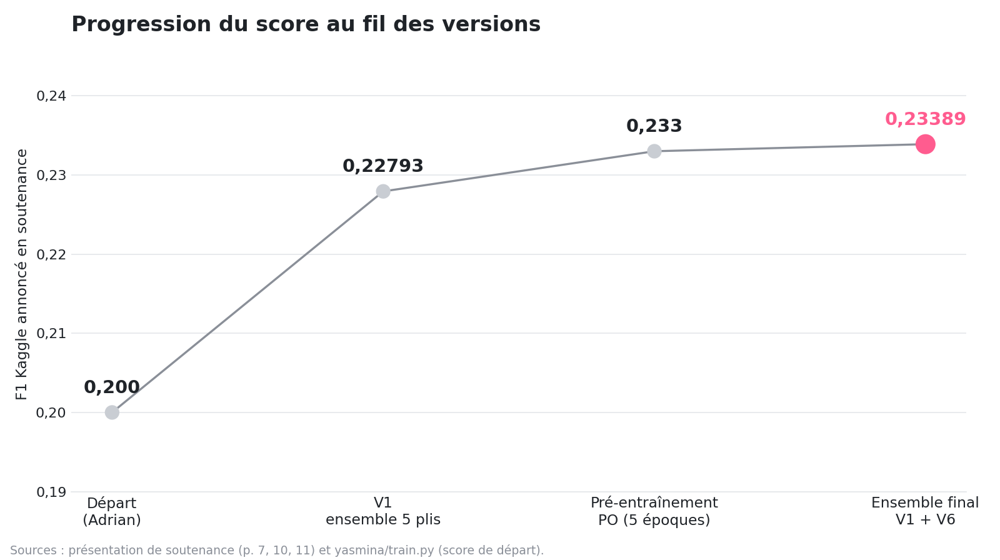
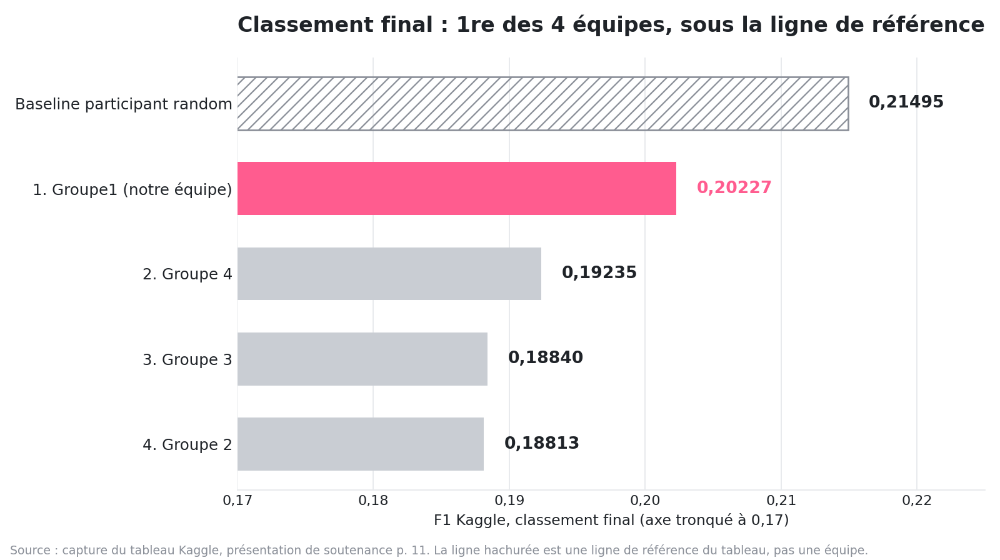

# GeoLifeCLEF 2025 multimodal : Challenge Deep Learning MIASHS 2026

Prédire, pour un point GPS en Europe, **l'ensemble des espèces végétales présentes** à partir d'images satellite,
de séries temporelles et de variables environnementales. Travail d'équipe réalisé en avril 2026 pour le
Challenge Deep Learning du master MIASHS (compétition Kaggle interne sur les données GeoLifeCLEF 2025).
Notre équipe (« Groupe1 ») a terminé **1re des 4 équipes** du classement final.

Ce dépôt est une republication nettoyée du dépôt d'équipe (licence MIT d'origine conservée) : code de chaque
membre, test de fumée exécutable sans données ni GPU, scores sourcés et graphiques.

## Problème

- **Tâche** : classification multi-label extrême. Chaque relevé (surveyId) doit recevoir une liste d'identifiants
  d'espèces ; le jeu d'entraînement Presence-Absence (PA) contient 88 987 relevés et 5 016 espèces
  (`results/logs/raihan_train_v2.log`, ligne « 88987 surveys | 5016 espèces »).
- **Entrées** : patch Sentinel-2 64 x 64 pixels à 4 canaux (R, G, B, proche infrarouge), séries Landsat
  saisonnières, séries bioclimatiques, variables tabulaires (climat moyen, altitude, sol, occupation du sol,
  empreinte humaine) et métadonnées (coordonnées, année, pays, région). Détail complet des données :
  [`docs/description-challenge.md`](docs/description-challenge.md) (README d'équipe d'origine).
- **Difficulté principale** : le décalage géographique entre entraînement et test. Selon la présentation de
  soutenance (page 9), 67,4 % des relevés de test sont à plus de 10 km des données d'entraînement, et l'Ukraine,
  la Bulgarie et le Royaume-Uni pèsent 20 %, 22 % et 6 % du test pour environ 0 % de l'entraînement.
- **Métrique** : F1 sur le jeu de test Kaggle. La présentation (page 2) parle de « F1-score micro » ; le code de
  validation (`yasmina/train.py`, `sample_f1_from_ranked_hits`) calcule un F1 par relevé moyenné sur les relevés,
  ce qui correspond au « sample-averaged F1 » décrit dans l'article GeoPlant (voir Données et licence).

## Résultats

Scores Kaggle recopiés de la présentation de soutenance et du code ; ils sont regroupés avec leur source dans
[`results/scores_kaggle.json`](results/scores_kaggle.json). Les soumissions et les poids ne sont pas publiés,
ces scores ne peuvent donc pas être recalculés depuis ce dépôt.

| Étape | F1 Kaggle | Source |
|---|---|---|
| Modèle de départ (Adrian) | 0,200 (public) | docstring de `yasmina/train.py` |
| V1 : même architecture, ensemble 5 plis, warmup + cosinus, clipping, 50 époques | 0,22793 | présentation, p. 7 |
| Pré-entraînement Presence-Only, 5 époques | 0,233 | présentation, p. 10 |
| Pré-entraînement Presence-Only, 15 époques | 0,175 | présentation, p. 10 |
| Pré-entraînement avec 7 variables auxiliaires / avec 57 | 0,233 / 0,226 | présentation, p. 10 |
| **Ensemble final : V1 + V6, 10 modèles (5 par version), moyenne des logits** | **0,23389** | présentation, p. 11 |



**Classement final** (capture du tableau Kaggle, présentation p. 11) :

| Rang | Équipe | F1 | Soumissions |
|---|---|---|---|
| (référence) | Baseline participant random | 0,21495 | 1 |
| 1 | Groupe1 (notre équipe) | 0,20227 | 29 |
| 2 | Groupe 4 | 0,19235 | 31 |
| 3 | Groupe 3 | 0,18840 | 29 |
| 4 | Groupe 2 | 0,18813 | 29 |



La ligne « Baseline participant random » est **au-dessus de toutes les équipes**, y compris la nôtre : voir Limites.

Scores de **validation interne** (validation spatiale, un seul pli, pas des scores Kaggle) enregistrés par les
entraînements d'Adrian : 0,3459 et 0,3495 (`results/validation/*.json`). Leur écart avec les scores Kaggle
illustre le décalage géographique du test.

## Architecture

Modèle multimodal à fusion tardive (`yasmina/model.py`, `Adrian/v6_package/model.py`) : une branche par modalité,
chacune projetée en un embedding de 128 dimensions, concaténation, puis tête de fusion
(Linear, GELU, LayerNorm, Dropout, 512 unités) et un logit par espèce (BCEWithLogitsLoss).

| Branche | Entrée (forme) | Encodeur |
|---|---|---|
| Image Sentinel-2 | 4 x 64 x 64 | EfficientNet-B3 pré-entraîné ImageNet, première convolution étendue à 4 canaux (canal NIR initialisé avec les poids du rouge) |
| Série Landsat | 21 pas x 24 variables | Transformer (2 couches, 4 têtes) |
| Série bioclimatique | 12 pas x 76 variables | Transformer (2 couches, 4 têtes) |
| Variables environnementales | 64 | MLP 256, 128 |
| Variables auxiliaires | 57 | MLP 128, 128 |

Le nombre d'espèces prédites par relevé n'est pas fixe : il vaut la somme des probabilités multipliée par un
facteur `alpha`, borné entre `min_k` et `max_k`, et `alpha` est calibré sur la validation
(`calibrate_alpha` dans `yasmina/train.py`).

Le projet comprenait aussi un volet d'interprétation : un serveur MCP (17 outils) interrogé par un agent LangChain,
avec des outils de filtrage des données, de statistiques écologiques, d'explication par Gradient x Input et de
reformulation par LLM (présentation p. 13 à 18, dossier `MCP_server/`).

## Qui a fait quoi

Répartition issue de la présentation de soutenance (p. 4 et p. 13) et de l'organisation du dépôt d'équipe.

| Membre | Rôle | Dossiers |
|---|---|---|
| **Yasmina Saoud** | Modélisation : exploration, amélioration du modèle, analyse des résultats | `yasmina/` |
| Adrian Guilhem | Modélisation : exploration, amélioration du modèle, soumissions Kaggle | `Adrian/` |
| Raihan Meguenni | MCP, données : filtres et accès aux données, explicabilité | `Raihan/`, `MCP_server/tools_data.py`, `MCP_server/tools_explain.py` |
| Malala Ravalisaona | MCP, statistiques : analyses écologiques, explicabilité | `Malala/`, `MCP_server/tools_stats.py` |
| Guilhem Darde | MCP, LLM et serveur : explications LLM, déploiement, démo | `Guilhem/`, `MCP_server/tools_llm.py`, agent, interface web, `server.py` |

Le dossier `yasmina/` contient le modèle avec la branche image EfficientNet-B3 (`model.py`), la version V1
(`train.py` : ensemble 5 plis avec moyenne des logits, warmup puis cosinus, précision mixte, clipping de gradient,
grille `alpha` plus fine) et le script de pré-entraînement Presence-Only puis fine-tuning Presence-Absence
(`train_po_pretrain.py`). Une copie de `train.py` et de `train_po_pretrain.py` figure aussi dans
`Adrian/v6_package/` : le dépôt d'équipe partagé ne permet pas d'attribuer chaque ligne à une personne.

## Reproduire

### Test de fumée (sans données, sans GPU)

Depuis un clone vierge, avec [uv](https://docs.astral.sh/uv/) :

```bash
git clone https://github.com/yzasmin/geolifeclef-2025-multimodal.git
cd geolifeclef-2025-multimodal
uv sync
uv run pytest -s -v
```

Le test instancie `yasmina/model.py` (avec et sans branche image) et `Adrian/v6_package/model.py`
(EfficientNet-B3, ResNet-50, ConvNeXt-Tiny), fait un passage avant sur des tenseurs aléatoires aux formes réelles
(env_dim 64, aux_dim 57, 5 016 espèces) et vérifie la sortie `(2, 5016)`. Les poids ImageNet ne sont pas
téléchargés. Sortie obtenue : 6 tests réussis en 3 min 24 s sur un portable (CPU, moins de 1 Go de RAM libre),
voir [`results/smoke_test_output.txt`](results/smoke_test_output.txt).

Graphiques : `uv run python scripts/make_figures.py`.

### Entraînement complet (données et GPU nécessaires)

1. Créer un compte Kaggle, accepter les règles de la compétition GeoLifeCLEF 2025, puis télécharger les données PA :
   `kaggle competitions download -c geolifeclef-2025` (ou depuis l'onglet Data de
   <https://www.kaggle.com/competitions/geolifeclef-2025>). Les données Presence-Only et les rasters d'origine
   sont sur le dépôt Seafile des organisateurs, lié depuis la même page, ou via le jeu de données GeoPlant.
2. Placer les fichiers sous `./data` (ou définir `GLC_DATA_DIR`), copier `.env.example` en `.env`.
3. Installer les dépendances d'entraînement de l'équipe (`requirements.txt`, Python 3.8, torch 2.4.1 CUDA 12.1),
   puis par exemple : `cd yasmina && python train.py --all-folds --epochs 50 --batch-size 64 --use-image-branch`
   et `python train.py --ensemble-predict --use-image-branch`.

L'équipe a entraîné sur des serveurs universitaires (4 x RTX 3090 et 4 x RTX 2080 Ti, présentation p. 5). Les
arborescences de données attendues par chaque script varient d'un membre à l'autre (voir les fonctions
`resolve_*` de `yasmina/train.py`).

## Structure

```
yasmina/            modèle EfficientNet-B3 multimodal, V1 (ensemble 5 plis), pré-entraînement PO
Adrian/             modèle et entraînement d'origine, v6_package/ (backbones EfficientNet-B3, ResNet-50, ConvNeXt-Tiny)
Raihan/             pipelines multimodaux avec validation « leave-region-out »
Malala/             modèle environnemental, explicabilité (GradCAM, SHAP, attention Landsat)
Guilhem/            package sdm/ (teacher-student, pseudo-labels PO), scripts et tests
MCP_server/         serveur MCP, agent LangChain, interface web, outils données, statistiques, explication, LLM
scripts/            lancement de l'interface MCP, génération des graphiques
tests/test_smoke.py test de fumée des architectures
results/            scores sourcés, résumés de validation, log d'entraînement nettoyé, sortie du test
figures/            graphiques du README
docs/               README d'équipe d'origine (description du challenge et des données)
teaser/             variables et graphiques en thème sombre pour la vidéo du portfolio
```

## Données et licence

- **Code** : licence MIT, « Copyright (c) 2026 Guilhem » (fichier `LICENSE` d'origine du dépôt d'équipe).
- **Données** : les données GeoLifeCLEF 2025 reprennent le jeu de données GeoPlant (Picek et al., NeurIPS 2024,
  Datasets and Benchmarks), publié sous licence **CC BY 4.0** selon l'article
  (<https://arxiv.org/abs/2408.13928>). Ce dépôt ne redistribue aucune donnée : elles se téléchargent depuis Kaggle
  et Seafile. La page de données Kaggle de GLC25 n'a pas pu être lue automatiquement (page dynamique) : vérifier
  les règles de la compétition avant tout usage.
- La présentation de soutenance (PDF) n'est pas redistribuée ; ses chiffres sont recopiés avec leur numéro de page.

## Limites

- **La ligne de référence bat toutes les équipes.** Au classement final, « Baseline participant random » (0,21495)
  est au-dessus de notre score (0,20227) et de ceux des trois autres équipes. Notre première place est un rang
  parmi les équipes, pas une victoire sur cette référence. La présentation ne dit pas comment elle a été construite.
- **Deux scores pour la même équipe.** L'ensemble final est annoncé à 0,23389 (p. 11) alors que le tableau final
  affiche 0,20227. Hypothèse, non confirmée par les fichiers : 0,23389 serait un score du classement public
  (calculé sur une partie du test ; le code qualifie bien le 0,200 de départ de « public ») et 0,20227 le score du
  classement privé révélé en fin de compétition. Il est aussi possible que la soumission retenue pour le
  classement final ne soit pas l'ensemble. Sur le classement public, 0,23389 aurait dépassé 0,21495, mais le score
  de la référence sur ce même classement n'est pas connu.
- **Généralisation géographique.** Écart important entre la validation interne (environ 0,35) et Kaggle (environ
  0,20 à 0,23) : régions du test quasi absentes de l'entraînement, espèces rares (3 203 espèces à moins de 10
  occurrences dans le split d'entraînement du log de Raihan).
- **Reproductibilité partielle.** Poids, caches et soumissions n'ont pas été conservés. Aucun script ne combine
  les versions V1 et V6 en un seul ensemble dans le dépôt. `yasmina/train_po_pretrain.py` est réglé sur 15 époques
  et 57 variables auxiliaires, soit la variante que la présentation mesure moins bonne (0,175 et 0,226) ; le
  réglage à 5 époques et 7 variables (0,233) n'est pas conservé tel quel.
- **Figures d'explicabilité.** Les PNG de `Malala/explanations/` ont été produits avec le chargeur factice de
  `explain_example.py` (les images d'entrée du GradCAM sont du bruit aléatoire) : ce sont des sorties de test du
  pipeline, pas des explications du modèle sur les vraies données.

## Crédits

Équipe « Groupe1 », Challenge Deep Learning MIASHS 2026 : Yasmina Saoud, Malala Ravalisaona, Raihan Meguenni,
Adrian Guilhem, Guilhem Darde. Données : organisateurs de GeoLifeCLEF 2025 (LifeCLEF) et
jeu de données GeoPlant (Picek et al., 2024). Republication et nettoyage : Yasmina Saoud.
